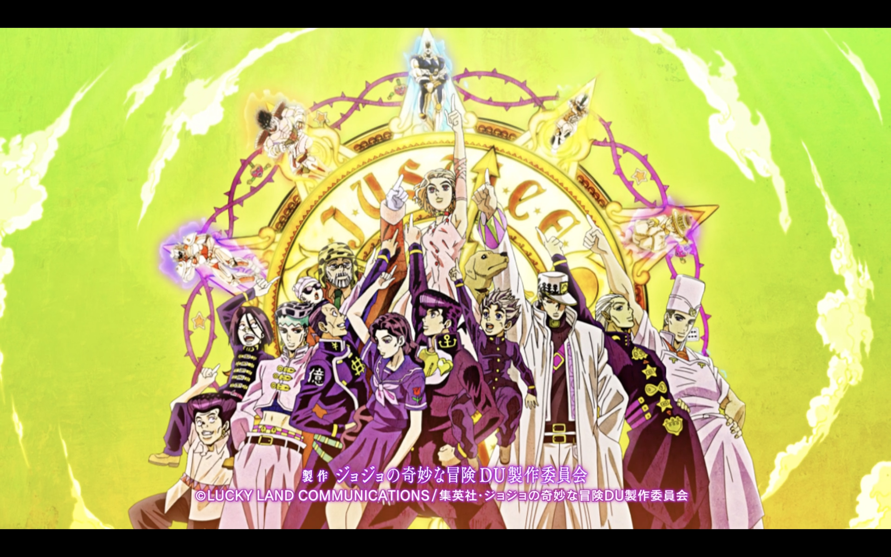

# morioh

## Description

Shared system configurations and deployments for some my JoJo themed garbage (computers).

## TODO

- [ ] init with [colmena](https://github.com/zhaofengli/colmena)
- [ ] test out [remote builds](https://colmena.cli.rs/unstable/features/remote-builds.html)
    - a macOS host should be able to deploy a config to a NixOS/Linux target
- [ ] test out [binfmt emulation](https://colmena.cli.rs/unstable/examples/multi-arch.html#using-binfmt-emulation)
    - a x86_64-linux host should be able to build an aarch64-linux deployment **locally** (i.e. cross-arch) and then deploy it to a target
    - try this out with some [native images](https://nixos.wiki/wiki/NixOS_on_ARM#Build_your_own_image_natively) for a Raspberry Pi built on an `x86_64-linux` machine
- [ ] minimize plaintext keys stored on device with [secrets](https://colmena.cli.rs/unstable/features/keys.html)
    - plaintext keys should _only_ decrypt system partitions
    - all data partitions (and associated services) await some corresponding `systemd` unit, which indicates that the secret has been supplied
    - MVP is just reading from some plaintext files on the host
    - later iteration 
    - be very careful to always permit SSH access (leave allowed public keys in the config file) so as to avoid having to manually connect up to the machine and debug
